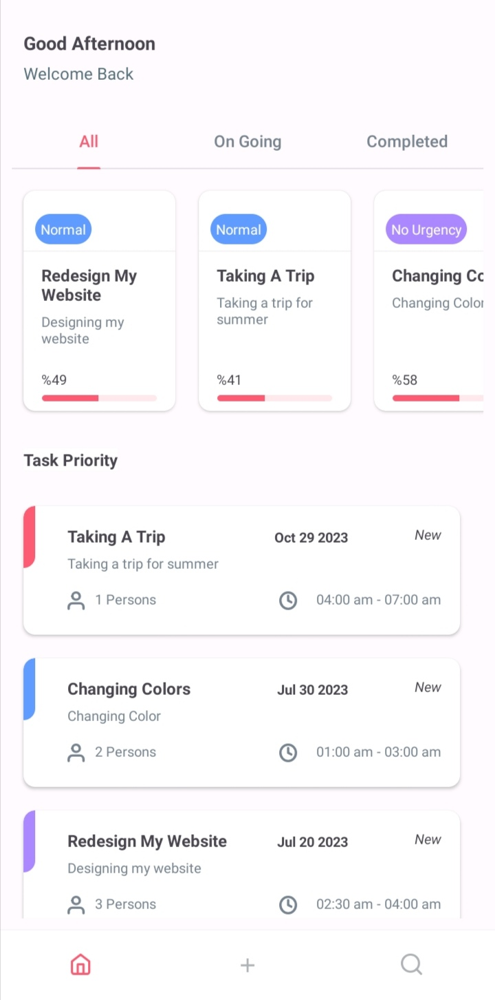
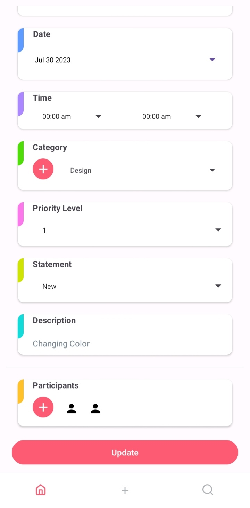
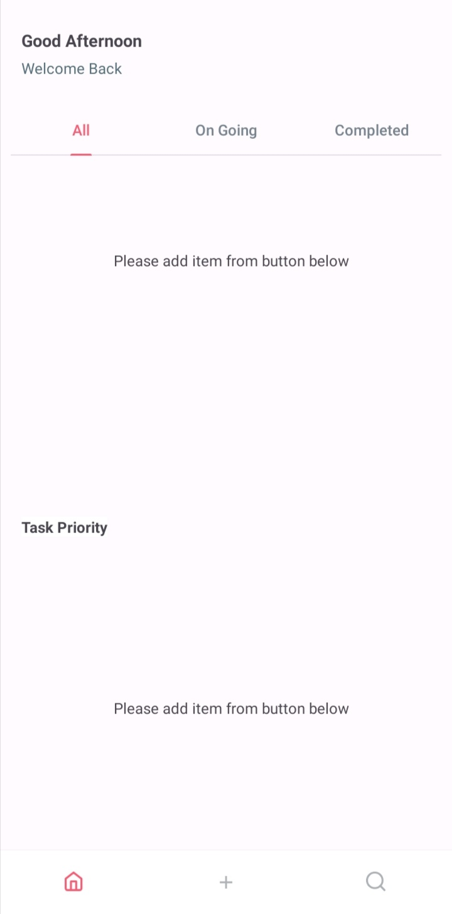
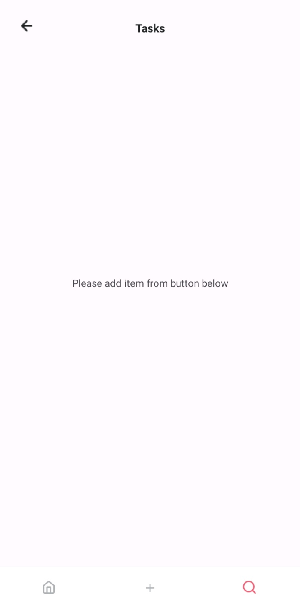
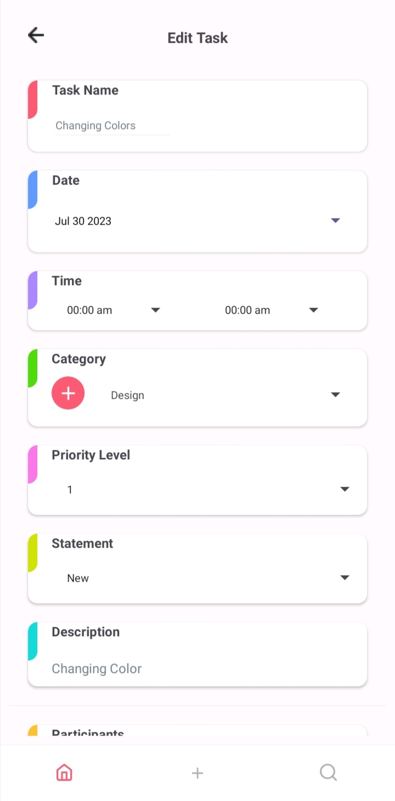
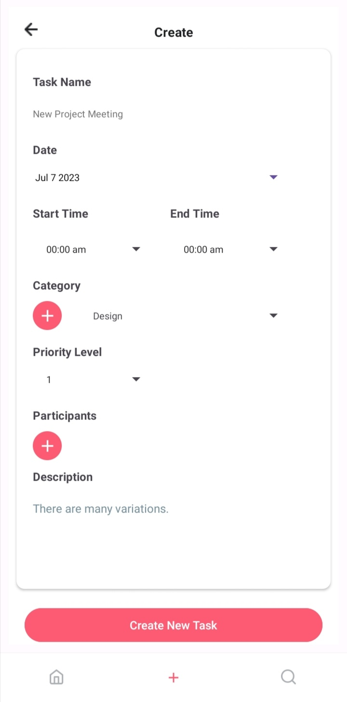
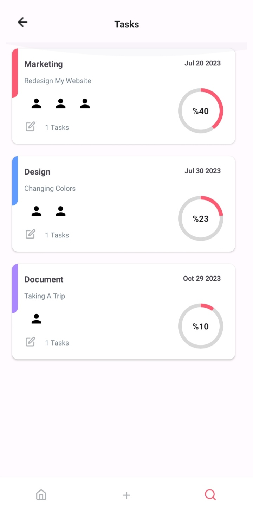

# Task Manager

Bu uygulamada görevlerinizi ekleyebilir, takip edebilir ve güncelleyebilirsiniz.

  
  
  
  
  
  
  

##  Kütüphaneler

- Room
- Coroutine
- Firebase Crashlytics
- Navigation Component
- Material Component

- Mvvm
- Data Binding

## Anasayfa

-> Bu sayfa eklenilen görevler durumuna ve  tarihlerine göreye iki farklı listede sıralanmıştır. Seçilen duruma göre tekrar sıralı hali listeli bi şekilde görülebilir.

-> Üstüne tıklanılan görev özellikleriyle birlikte güncelleme sayfasında gösterilmek üzere oraya yönlendirilir.
## Görev Ekleme Sayfası

-> Bu sayfada görevin ismi, tarihi zamanı ve diğer özellikleri seçilerek oluşturulabilir.
## Güncelleme Sayfası

-> Güncelleme ekranında ana sayfadan seçilen görevin özellikleri burada değiştirilerek
güncellenebilir.

## Kategori Sayfası

-> Kategori sayfası oluşturulan görevlerin seçilen kategoriye göre gruplandılarak gösterildiği sayfadır.  